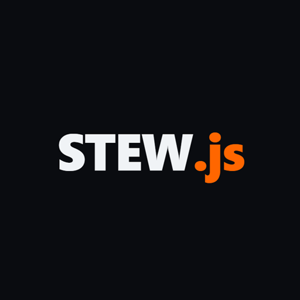

<div align=center>



# STEW Starter

A minimal, high-performance project template built on my STEW stack.

I purpose-built this template for developers who want to stick to raw HTML and CSS, backed by the reliability of type-safe JavaScript, without dealing with complex frameworks or bloated tooling.

</div>

**Live Landing Page:** Check out the interactive demo page at [ichimakikasura.github.io/Stew/](https://ichimakikasura.github.io/Stew/)

> **Note:** This stack is built entirely on my own preferences. It works exactly how I like to build, skipping the heavy setup and keeping things brutally fast. Feel free to tweak it, tear it apart, or modify it your own way.
>
> **Contributions:** No pull requests or issues will be accepted. As I mentioned above, if you want changes, you can fork it and modify it your own way.

---

## The STEW Stack

- **S**erverless — Zero server management.
- **T**ypeScript — Type-safe client-side logic.
- **E**dge — Backend logic executes globally.
- **W**eb — Built with raw web standards.

---

## Project Structure

```text
├── build/              # Custom compiler and bundler
├── src/                # Static site source and app assets
│   └── wrangler.jsonc  # Edge deployment configuration
├── ts/                 # Client-side TypeScript logic
├── api/                # Worker entrypoints
│   ├── localworker.js  # For Development/Tests
│   └── worker.js       # For production/live
├── package.json
├── tsconfig.json
├── wrangler.json       # Local/Testing stage configuration
└── readme.md
```

---

### Docs

- [HTML Modifiers (`stew-mod`)](docs/build/html-modifiers.md)

---

## My Build Pipeline

My compiler cleans out development flags, handles path mapping on the fly, and strips down assets for zero-bloat delivery.

### Development Build (`npm run build:dev`)
- **TypeScript:** Compiles client-side TS logic down to ES Modules.
- **HTML:** Strips out local dev tokens via regex, minifies the markup, and outputs to `dist/`.
- **JavaScript:** Replaces development blocks (for example toggling `__DEV__` from `true` to `false`), remaps relative file imports to target compiled `.min.js` files, minifies with Terser, and outputs to `dist/`.
- **CSS:** Individually minifies component stylesheets into `dist/css/*.min.css`.
- **Assets:** Copies images and raw unhandled files directly into `dist/`.

### Live Production Build (`npm run build:prod`)
Runs the same optimization process as the development build, with one major performance upgrade for the layout:
- **CSS Bundling:** Instead of copying individual stylesheets, it reads the entire `src/css/` directory, concatenates every file into a unified stream, pushes it through CleanCSS, and serves a single optimized `/css/bundle.min.css`.
- **HTML Refactoring:** Automatically strips individual `<link>` elements, injects the bundled stylesheet, applies `stew-mod` attribute replacements, and minifies the final HTML.

---

## Local Testing & Workflows

Ensure you have Node.js installed, then clone the repository and install dependencies:

```bash
npm install
```

I included several custom utility pipelines depending on your development workflow:

#### Full Stack Integration Test
To run my custom esbuild compiler watcher alongside the active Cloudflare Wrangler emulator concurrently:

```bash
npm run test:site
```

#### Manual Serverless Sandboxing
To launch just the Wrangler staging environment using local testing configs:

```bash
npm run wrangler:dev
```

#### Available Build and Test Commands
- `npm run build:test` — Compile TypeScript and execute the builder in test mode.
- `npm run build:ts` — Run the raw TypeScript compiler.
- `npm run ts:watch` — Use esbuild to watch and bundle client script changes directly into `src/js/`.
- `npm run test:ts` — Run a deep, verbose diagnostic check on your TypeScript configurations.

---

## Deployment Workflow

To prepare build artifacts for the live web, generate the optimized code output:

```bash
npm run build:prod
```

### If you want to make it live using Cloudflare:

#### 1. Frontend & Client-Side Assets
1. Navigate to your Cloudflare Dashboard and spin up a new Pages project.
2. Upload the newly generated production `dist/` directory and link it up to your domain.

#### 2. Backend API (Edge Worker)
1. Head over to Workers & Pages in your Cloudflare dashboard and create a new Worker.
2. Open your local `worker/worker.js` file and copy the native ES Module handler (`export default`).
3. Paste it directly into the Cloudflare online code editor, hit Save and Deploy, and you are live.

---

## Database & Storage

I don't lock this starter into any specific database layer. You are free to configure your data storage however you prefer (PostgreSQL, MongoDB, Supabase, etc.) via HTTP or WebSockets.

### My Recommended Native Options
If you are deploying to Cloudflare and want zero-cold-start performance, I highly recommend using their built-in data primitives:
- **Cloudflare D1** — A native serverless SQL database built on SQLite. Perfect for relational data.
- **Cloudflare KV** — A global, low-latency, key-value data store. Perfect for configurations, quick data caching, or session tracking.

To use them, simply hook up your bindings directly inside your `wrangler.json` / `wrangler.jsonc` configs.

---

## License

This project is licensed under the MIT License — feel free to use it for whatever you want.